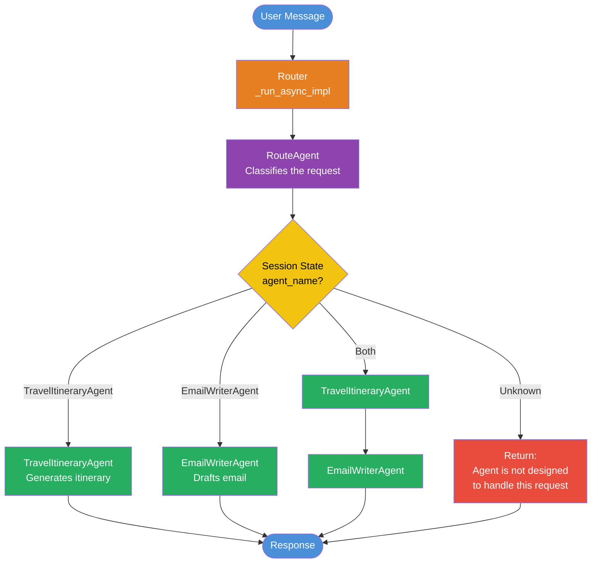

# Google ADK Agents

A collection of AI agent examples built with [Google's Agent Development Kit (ADK)](https://google.github.io/adk-docs/) and [LiteLLM](https://docs.litellm.ai/), showcasing different agent orchestration patterns -- single, sequential, parallel, loop, custom routing, multimodal image analysis, and vector-search-based image suggestion.

## Agents

| Agent | Pattern | Description |
|---|---|---|
| **single_agent** | Single LLM | A Q&A assistant with a custom response-formatting tool. |
| **sequential_agent** | Sequential | A three-stage pipeline: DSA code writer, test-case generator, and solution combiner. |
| **parallel_agent** | Parallel + Sequential | Two research agents run in parallel (concise & detailed), then a merger agent combines their outputs. |
| **loop_agent** | Loop | A reporter agent drafts a report and a reviewer agent critiques it, iterating up to 5 times until the review passes. |
| **custom_routing_agent** | Custom (BaseAgent) | A custom orchestrator that uses an LLM classifier to route requests to a travel itinerary agent or an email writer agent. |
| **image_researcher** | Single LLM (multimodal) | Accepts an image upload and a question, analyzes the image via GPT-4o, and returns structured data following a Pydantic output schema. |
| **style_orchestrator** | Single LLM + Tools | Suggests product images from a MongoDB vector store based on natural-language queries, using VoyageAI multimodal embeddings and MongoDB Atlas Vector Search. |

## Custom Routing Agent -- Orchestration Flow

The `custom_routing_agent` demonstrates how to build a [Custom Agent](https://google.github.io/adk-docs/agents/custom-agents/) by extending `BaseAgent` and implementing `_run_async_impl` with conditional routing logic.



**How it works:**

1. The `Router` (a custom `BaseAgent`) receives the user message.
2. It invokes the `RouteAgent` LLM, which classifies the request and writes its decision to `session.state["agent_name"]`.
3. The `Router._run_async_impl` reads the state and conditionally delegates:
   - `"TravelItineraryAgent"` -- routes to the travel agent
   - `"EmailWriterAgent"` -- routes to the email agent
   - `"Both"` -- runs both agents sequentially
   - `"Unknown"` -- returns a fallback message

## Project Structure

```
google-adk/
├── single_agent/            # Simple Q&A agent with a tool
├── sequential_agent/        # Multi-step DSA code + test pipeline
├── parallel_agent/          # Concurrent research with result merging
├── loop_agent/              # Iterative report writing with review loop
├── custom_routing_agent/    # Custom routing agent (BaseAgent)
│   ├── agent.py             # Runner setup and root_agent entry point
│   ├── routing.py           # Router custom agent with _run_async_impl
│   └── agents.py            # Sub-agent definitions (Route, Travel, Email)
├── image_researcher/        # Multimodal image analysis agent
│   └── output_schema.py     # Pydantic response schema
├── style_orchestrator/      # Image suggestion via vector search
│   ├── agent.py             # Agent definition with before/after callbacks
│   ├── image_suggester.py   # Vector search tool (MongoDB + VoyageAI)
│   ├── image_embedder.py    # One-time script to embed & store images
│   ├── voyage_client.py     # VoyageAI client wrapper
│   └── images/              # Sample product images
├── requirements.txt
└── README.md
```

Each agent directory contains:
- `agent.py` -- agent definition and logic
- `__init__.py` -- re-exports the agent module
- `.env` -- environment variables (API keys, not tracked in git)

## Prerequisites

- Python 3.11+
- An Azure OpenAI deployment of **GPT-4o** (or swap the model string in each `agent.py`)
- [Google ADK CLI](https://google.github.io/adk-docs/) installed
- **For `style_orchestrator` only:**
  - A [VoyageAI](https://www.voyageai.com/) API key (multimodal embedding model)
  - A [MongoDB Atlas](https://www.mongodb.com/atlas) cluster with Vector Search enabled

## Setup

1. **Clone the repository**

```bash
git clone https://github.com/<your-username>/google-adk.git
cd google-adk
```

2. **Create a virtual environment and install dependencies**

```bash
python -m venv .venv
source .venv/bin/activate
pip install -r requirements.txt
```

For the `style_orchestrator`, install its additional dependencies:

```bash
pip install voyageai pymongo certifi pillow
```

3. **Configure environment variables**

Create a `.env` file in the project root (or inside each agent directory). At minimum you'll need:

```env
AZURE_API_KEY=<your-azure-openai-key>
AZURE_API_BASE=<your-azure-endpoint>
AZURE_API_VERSION=<api-version>
```

For `style_orchestrator`, add the following variables:

```env
VOYAGE_API_KEY=<your-voyageai-api-key>
VOYAGE_MULTI_MODAL_MODEL=voyage-multimodal-3.5
MONGO_CONNECTION_STRING=<your-mongodb-atlas-connection-string>
MONGO_DATABASE_NAME=<your-database-name>
MONGO_COLLECTION_NAME=<your-collection-name>
```

4. **Seed the vector store (style_orchestrator only)**

Before using the style orchestrator, embed the sample product images into MongoDB:

```bash
python -m style_orchestrator.image_embedder
```

This creates multimodal embeddings via VoyageAI and stores them alongside the image binaries in your MongoDB collection. Make sure you have a **Vector Search index** named `image_index` on the `embedding` field.

## Running an Agent

Use the ADK CLI to serve any agent locally with the web UI:

```bash
adk web .
```

This launches a local dev server where you can select and interact with any of the agents through a browser-based chat interface. Add `--reload` for live-reloading during development:

```bash
adk web --reload .
```

## License

This project is licensed under the Apache License 2.0 -- see [LICENSE](LICENSE) for details.
